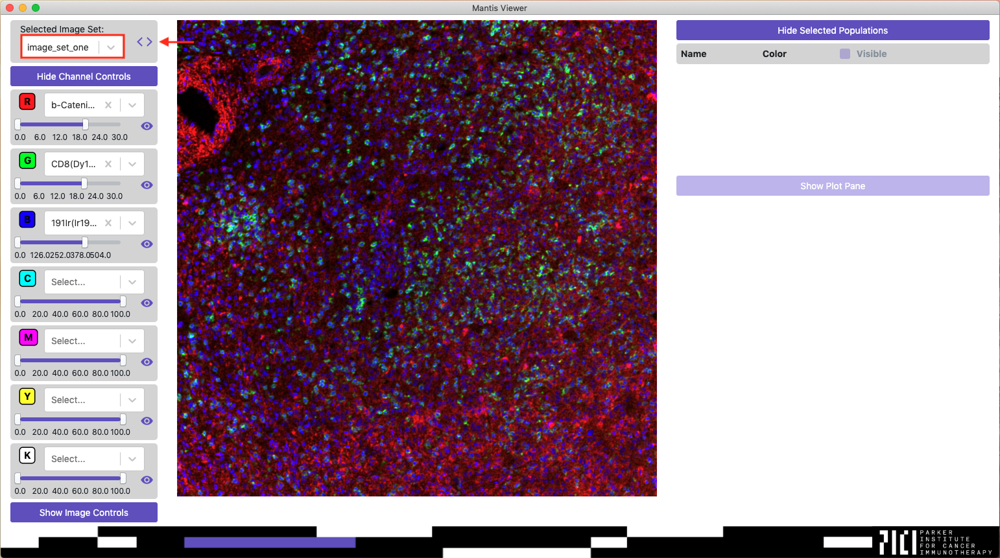

## Overview

Mantis Viewer allows users to load and analyze sets of images, or 'image sets' that contain multiple TIFF files. Each TIFF should contain one or multiple greyscale images of markers from a tissue slide. The below animation gives a brief overview of opening an image set and interacting with the channel and image controls. See below for detailed instructions.

<video width="640" autoplay="autoplay" loop="loop">
  <source src="{{site.baseurl}}/assets/videos/open_image_640.mp4" type="video/mp4">
  <source src="{{site.baseurl}}/assets/videos/open_image_640.mp4" type="video/webm">
</video>

## Supported Image Formats

Mantis currently supports loading images from two types of TIFFs: a folder containing multiple greyscale single-image TIFFs or a folder containing one greyscale multi-image TIFF. In the case of multi-image TIFFs, each image within the TIFF must be stored within its own image file directory (IFD). Mantis does not support other types of multi-image TIFF files (such as hyperstacks), but there are plans to add support in the future. In the interim you can use [image-utils](https://github.com/ParkerICI/image-utils) to split up unsupported multi-image TIFFs into single channel TIFFs that can be analyzed by Mantis.

### Inferring Marker Names
Mantis will attempt to parse the ImageDescription tag for each image file directory as an XML string. If parsing is successful Mantis will search for an element called `name` within the parsed XML tree. If Mantis finds an element called `name` it will take the text value of the `name` element and use that value as the marker name. If Mantis is unable to parse the ImageDescription tag as an XML string or does not find an element called `name`, it will use the filename as the marker name. In the case of multi-image TIFFs, Mantis will append the image file directory index to the filename and use that as the marker name if it is unable to find a name in the ImageDescription tag.

### Downsampling Images
Mantis will downsample images when either the width or the height of the image is greater than 10,000 pixels. There are plans to build support for viewing higher resolution images without downsampling in later releases.

### Additional Formats
If you encounter an image that you expect to work with Mantis but doesn't or if you need help getting your images into a format that Mantis supports feel free to [create an issue on the GitHub page](https://github.com/ParkerICI/mantis-viewer/issues) or send us an email at <engineering@parkerici.org>.

## Opening Images

When you first load the application you should see a blank screen with a few unpopulated controls. Click the menu item named `mantis-viewer`, and then select `Open`.

In the `Open` submenu you should see option for `New Project`, `Existing Project` and `Image Set`, which represent the two ways of working with Mantis. If you just want to look at images from a single slide or ROI you can choose to import an image set. If you want to analyze and compare multiple image sets you can chose to open a new project.

For an image set Mantis expects one folder with a single multi-image TIFF or multiple single-image TIFFs (one per marker). If you have multiple images from many slides or ROIs, you can import a project. For a project, Mantis expects expects a folder containing multiple image sets. See the below screenshot for an example file structure of a project with detailed view of one of the contained image sets.

When you open a new project Mantis will open a popup (shown below) that will walk you through setting up the project. If you've already gone through the import process you can bypass it by choosing to open the project as an existing project.

When importing a new project, Mantis will first ask you to select the root directory of the project you would like to import. Once you've selected the root directory, Mantis will automatically select a representative image set for the rest of the process, but you can change the representative image set if you need to.

The image subdirectory dropdown will be populated with any directories that are present within the representative image set. It allows you to choose a directory within your representative image set that stores all of the image files. If unselected, Mantis will load all images from the root of each image set. If you do select an image subdirectory all of the image sets in the project must have the same image subdirectory folder name.

The region file and segmentation file dropdowns will be enabled and populated with files from the representative image set. You can read more about the formats that Mantis accepts for region and segmentation files on the [importing segmentation and region data page]({{ site.baseurl }}).

The segment features file and populations file dropdowns will be enabled and populated with CSV files from the root project directory. You can read more about the formats that Mantis accepts for segment features and population files on the [importing segment features]({{ site.baseurl }}) and [importing populations]({{ site.baseurl }}) pages.

## Full Screen
You can full screen the image by using the keyboard shortcut `Alt + F` or `Command/Windows + F`. You can exit full screen mode by pressing escape.

## Switching Between Image Sets

If you have loaded a project you can switch between the image sets in the project by using the dropdown under the title `Selected Image Set`, by using the arrows to the right of the dropdown, or by using the keyboard shortcut `Alt + Left or Right` or `Command/Windows + Left or Right`.

When switching between image sets the application will automatically copy the selected markers, brightness and visibility settings, and plot settings from image set to image set.

## Channel Controls

Once an image set or project has been selected Mantis will load the Channel Controls. Mantis will automatically choose markers to be displayed for the channels on the first load. Automatic marker selection behavior can be configured in [preferences]({{ site.baseurl }}). Mantis will automatically reload the last selected markers, brightness settings, and visibility settings on subsequent loads.

If you wish to change the marker selected for a channel you can click on the dropdown and select a new channel. If you wish to clear a channel you can click the `x` on the channel select dropdown.

You can adjust the brightness of a channel by changing the min and max values on the slider below the channel dropdown. The min and max values are set using the pixel intensities from the channel's TIFF. Brightness adjustments are achieved by means of a linear transform.

You can quickly toggle the visibility of a channel by clicking on the eye icon next to the brightness slider.

## Image Controls

Other image controls that do not affect the channels can be accessed by clicking on the button `Show Image Controls`.

From the Image Controls you can toggle the presence of a zoom inset indicator and a legend on the image that indicates which markers are currently visible and the channels they are selected for. Once [segmentation data]({{ site.baseurl }}) has been loaded, the Image Controls can also be used to adjust segmentation visualization settings.

## Selected Regions and Populations

You can select regions on the image or [populations]({{ site.baseurl }}) (once [segmentation data]({{ site.baseurl }}) has been loaded) by pressing Alt or Command/Windows and holding the left mouse button and outlining the region on the image. You can read more about populations in the [Populations page]({{ site.baseurl }})
