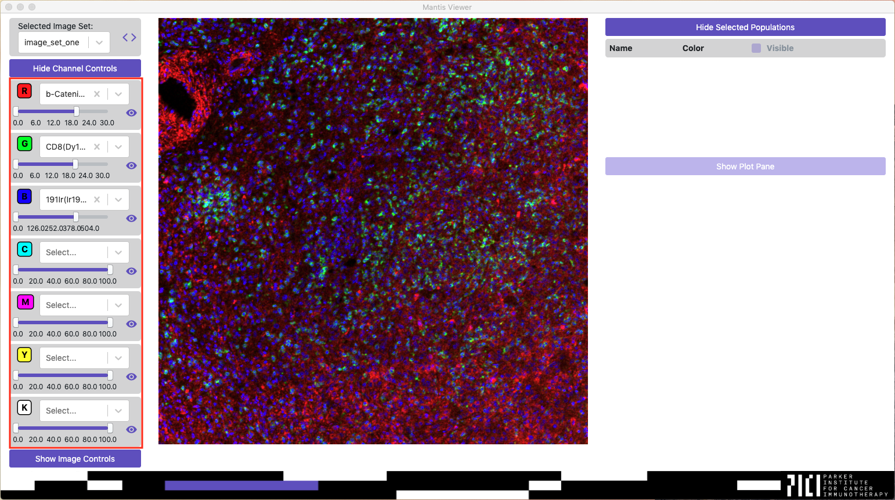
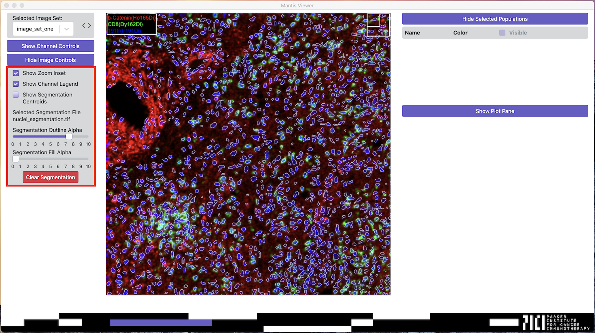
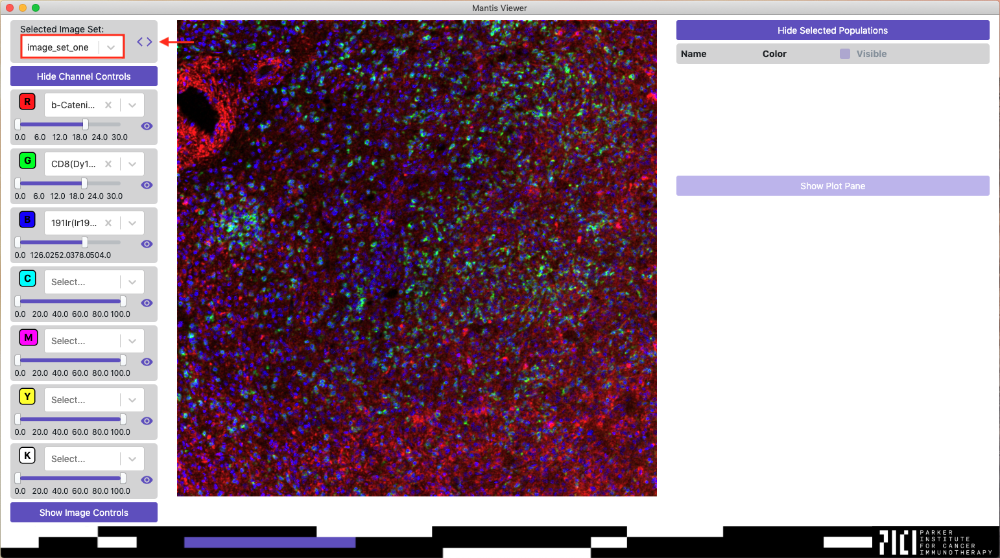

## Interacting with Images

### Channel Controls

Once an image set or project has been selected Mantis will load the Channel Controls. Mantis will automatically choose markers to be displayed for the channels on the first load. Automatic marker selection behavior can be configured in [preferences]({{ site.baseurl }}). Mantis will automatically reload the last selected markers, brightness settings, and visibility settings on subsequent loads.

If you wish to change the marker selected for a channel you can click on the dropdown and select a new channel. If you wish to clear a channel you can click the `x` on the channel select dropdown.

You can adjust the brightness of a channel by changing the min and max values on the slider below the channel dropdown. The min and max values are set using the pixel intensities from the channel's TIFF. Brightness adjustments are achieved by means of a linear transform.

You can quickly toggle the visibility of a channel by clicking on the eye icon next to the brightness slider.

### Image Controls

Other image controls that do not affect the channels can be accessed by clicking on the button `Show Image Controls`.

From the Image Controls you can toggle the presence of a zoom inset indicator and a legend on the image that indicates which markers are currently visible and the channels they are selected for. Once [segmentation data]({{ site.baseurl }}) has been loaded, the Image Controls can also be used to adjust segmentation visualization settings.

### Switching Between Image Sets

If you have loaded a project you can switch between the image sets in the project by using the dropdown under the title `Selected Image Set`, by using the arrows to the right of the dropdown, or by using the keyboard shortcut `Alt + Left or Right` or `Command/Windows + Left or Right`.

When switching between image sets the application will automatically copy the selected markers, brightness and visibility settings, and plot settings from image set to image set.

### Full Screen

You can full screen the image by using the keyboard shortcut `Alt + F` or `Command/Windows + F`. You can exit full screen mode by pressing escape.

### Selecting Regions and Populations

You can select regions on the image or [populations]({{ site.baseurl }}) (once [segmentation data]({{ site.baseurl }}) has been loaded) by pressing Alt or Command/Windows and holding the left mouse button and outlining the region on the image. You can read more about populations in the [Populations page]({{ site.baseurl }})
