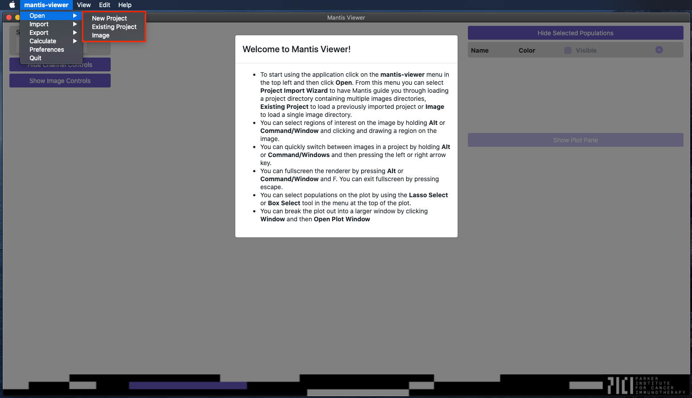
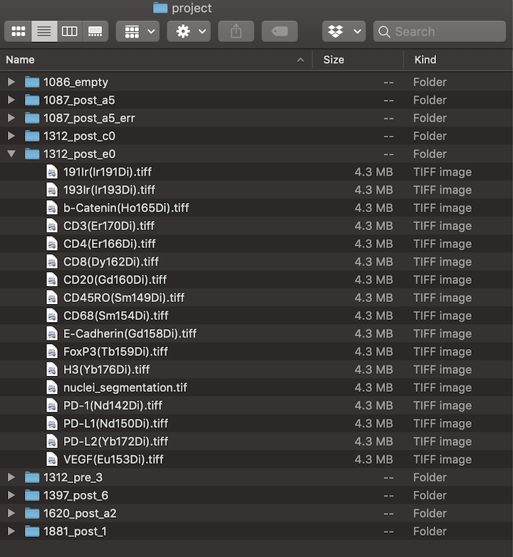

## Opening Images

When you first load the application you should see a blank screen with a few unpopulated controls. Click the menu item named `mantis-viewer`, and then select `Open`.

In the `Open` submenu you should see option for `New Project`, `Existing Project` and `Image`, which represent the two ways of working with Mantis. If you just want to look at a single slide or ROI you can choose to import an image. If you want to analyze and compare multiple images you can chose to open a new project.

For an image Mantis expects one folder with a single multi-page TIFF or multiple single-page TIFFs (one per marker). If you have multiple images from many slides or ROIs, you can import a project. For a project, Mantis expects expects a folder containing multiple images. See the below screenshot for an example file structure of a project with detailed view of one of the contained images.

When you open a new project Mantis will open a popup (shown below) that will walk you through setting up the project. If you've already gone through the import process you can bypass it by choosing to open the project as an existing project.

When importing a new project, Mantis will first ask you to select the root directory of the project you would like to import. Once you've selected the root directory, Mantis will automatically select a representative image for the rest of the process, but you can change the representative image if you need to.

The image subdirectory dropdown will be populated with any directories that are present within the representative image folder. It allows you to choose a directory within your representative image that stores all of the marker TIFFs. If unselected, Mantis will load all TIFFs from the root of each image folder. If you do select an image subdirectory all of the image folders in the project must have the same image subdirectory folder name.

The region file and segmentation file dropdowns will be enabled and populated with files from the representative image folder. You can read more about the formats that Mantis accepts for region and segmentation files on the [importing segmentation and region data page]({{ site.baseurl }}).

The dropdowns following the segmentation file dropdown will only be enabled if a file is selected for the segmentation dropdown.

Once enabled, the project segment features file and populations file dropdowns will be populated with CSV files from the root project directory. The image segment features file dropdown will bepopulated with CSV files from the representative image folder. You can read more about the formats that Mantis accepts for segment features and population files on the [importing segment features]({{ site.baseurl }}) and [importing populations]({{ site.baseurl }}) pages.

Once enabled, the calculate segment features dropdown will allow you to chose if Mantis will generate [segment features]({{ site.baseurl }}) as each image loads or for the whole project or if it will skip generating features.