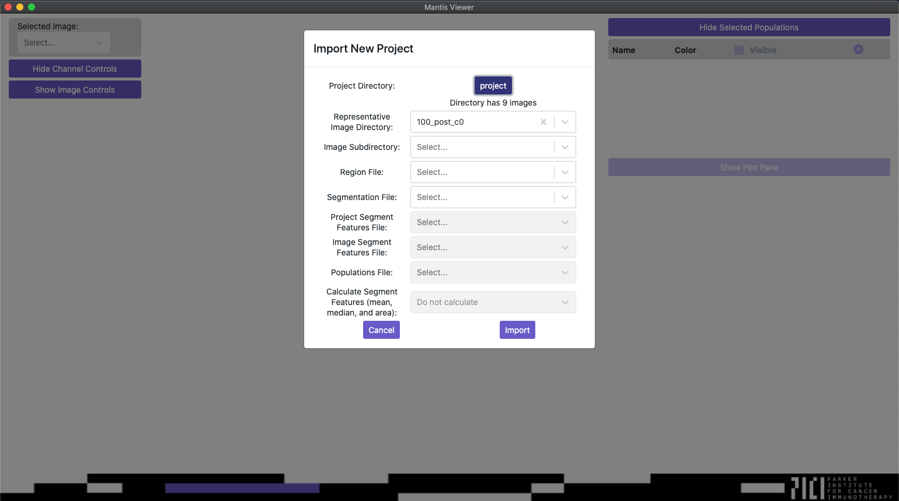

## Opening Images

When you first load the application you should see a blank screen with a few unpopulated controls. Click the menu item named `mantis-viewer`, and then select `Open`.

In the `Open` submenu you should see option for `New Project`, `Existing Project` and `Image Set`, which represent the two ways of working with Mantis. If you just want to look at images from a single slide or ROI you can choose to import an image set. If you want to analyze and compare multiple image sets you can chose to open a new project.

For an image set Mantis expects one folder with a single multi-image TIFF or multiple single-image TIFFs (one per marker). If you have multiple images from many slides or ROIs, you can import a project. For a project, Mantis expects expects a folder containing multiple image sets. See the below screenshot for an example file structure of a project with detailed view of one of the contained image sets.

When you open a new project Mantis will open a popup (shown below) that will walk you through setting up the project. If you've already gone through the import process you can bypass it by choosing to open the project as an existing project.

When importing a new project, Mantis will first ask you to select the root directory of the project you would like to import. Once you've selected the root directory, Mantis will automatically select a representative image set for the rest of the process, but you can change the representative image set if you need to.

The image subdirectory dropdown will be populated with any directories that are present within the representative image set. It allows you to choose a directory within your representative image set that stores all of the image files. If unselected, Mantis will load all images from the root of each image set. If you do select an image subdirectory all of the image sets in the project must have the same image subdirectory folder name.

The region file and segmentation file dropdowns will be enabled and populated with files from the representative image set. You can read more about the formats that Mantis accepts for region and segmentation files on the [importing segmentation and region data page]({{ site.baseurl }}).

The segment features file and populations file dropdowns will be enabled and populated with CSV files from the root project directory. You can read more about the formats that Mantis accepts for segment features and population files on the [importing segment features]({{ site.baseurl }}) and [importing populations]({{ site.baseurl }}) pages.