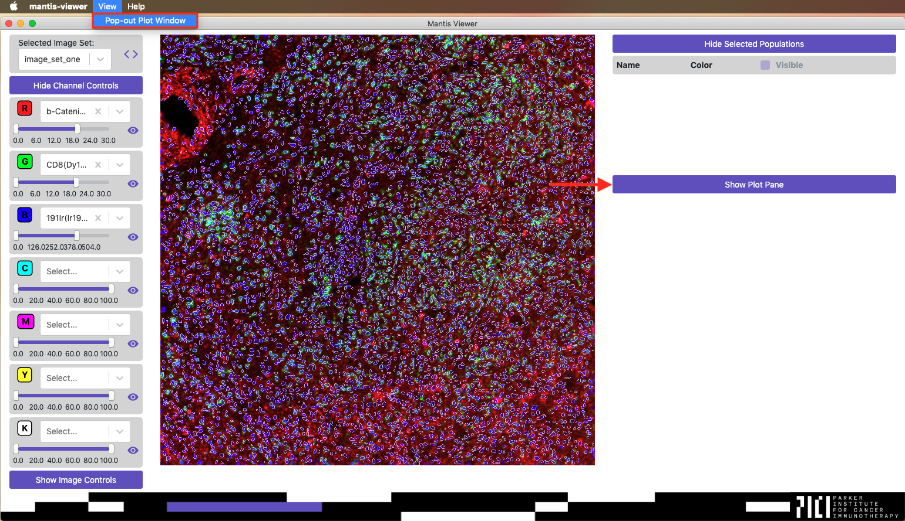
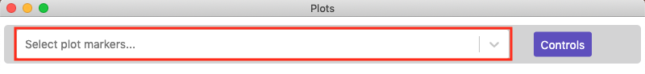
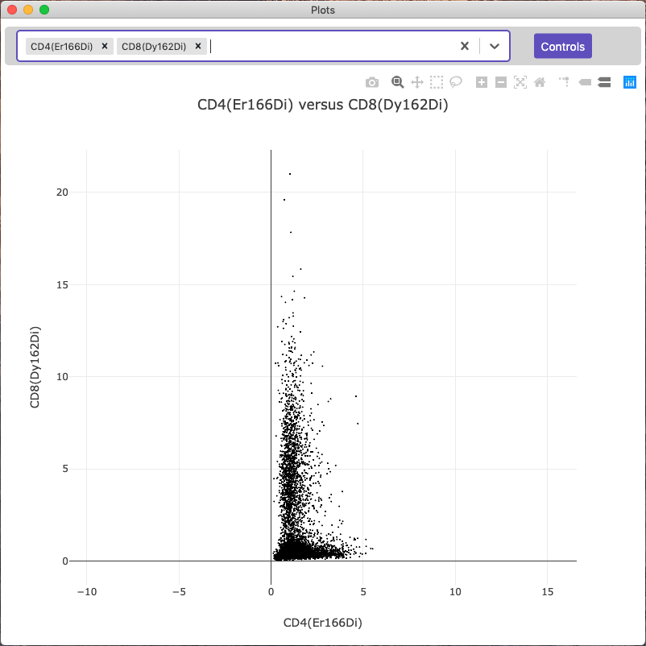
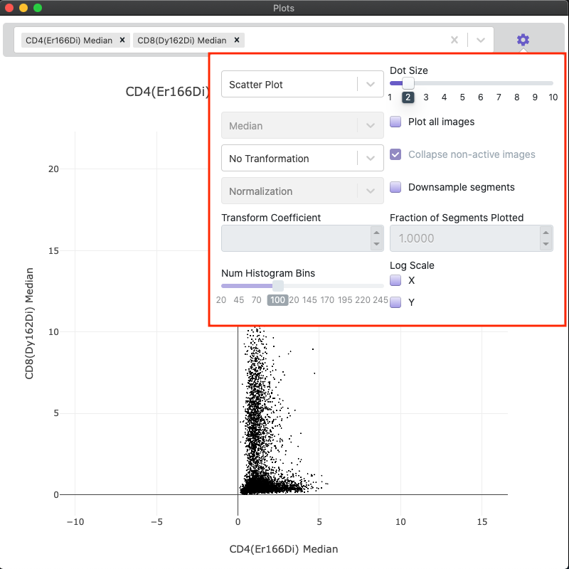

## Overview

Mantis Viewer can generate plots of any [segment features]({{ site.baseurl }}) that have been calculated or imported. [Segmentation data]({{ site.baseurl }}) must be loaded and [segment features]({{ site.baseurl }}) must be present for Mantis to generate plots. The following animation gives a brief overview of generating and interacting with plots in Mantis. See below for more detailed instructions.

<video width="320" autoplay="autoplay" loop="loop">
  <source src="{{site.baseurl}}/assets/videos/plot.mp4" type="video/mp4">
  <source src="{{site.baseurl}}/assets/videos/plot.mp4" type="video/webm">
</video>

## Basic Plotting in Mantis

 Once segmentation data has been loaded you can access plots by clicking the `Show Plot Pane` button or by selecting the `Pop-out Plot Window` entry in the `View` menu.

When you first load the plot view you should see a blank view with a dropdown that says `Select plot markers...`. If you do not see any options when you click on the dropdown it means that [segment features]({{ site.baseurl }}) have not been calculated or imported.

Click the field and start typing marker names. Once you've selected two different channels you should be shown a scatter plot comparing the intensities for each segment.

## Configuring  Plots

You can click the `Controls` button to the right of the marker selection field to change the type of plot, the plot statistic used, how the data is normalized, the size of dots on the plot, whether or not data from all image sets is shown, or if the data is downsampled.

Mantis is able to generate scatter plots, contour plots, histograms, and heatmaps. For heatmaps, Mantis can summarize the data using a mean or median calculation, and it can normalize per marker or per population.

Mantis can apply a Log or ArcSinh transformation with a user supplied coefficient to the data prior to plotting.

If you have loaded segment features for a project, Mantis is able to plot segment features for all image sets in a project. When plotting all segment features in a project, you can plot them per image set or have all of the features from non-active image sets collapsed into one group.

Mantis allows you to downsample the number of segments displayed on the plot. This is useful when the plot is slowed down or difficult to interpret due to a large number of data points.

## Selecting Populations from the Plot

You can select populations in the plot to view on the image or in other plots by using the lasso select or the box select tools.

Lasso select is disabled when plot data is downsampled due to technical limitations with the plotting library.

You can read more about populations on the [populations page]({{ site.baseurl }})