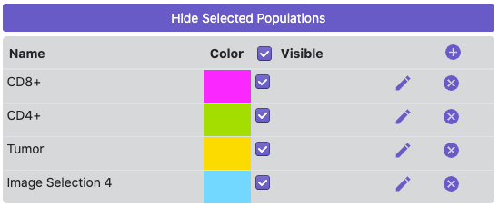

## Overview

Mantis Viewer allows users to select and store populations for further analysis. There are two ways to select populations in Mantis.

On the image:

<video autoplay="autoplay" loop="loop">
  <source src="{{site.baseurl}}/assets/videos/population_on_image_640.mp4" type="video/mp4">
  <source src="{{site.baseurl}}/assets/videos/population_on_image_640.mp4" type="video/webm">
</video>

Or from the graph:

<video autoplay="autoplay" loop="loop">
  <source src="{{site.baseurl}}/assets/videos/population_on_graph_640.mp4" type="video/mp4">
  <source src="{{site.baseurl}}/assets/videos/population_on_graph_640.mp4" type="video/webm">
</video>

See below for detailed instructions on how to select populations in Mantis.

## Selecting Regions or Populations

You can select a region on the image by pressing Alt or Command/Windows and holding the left mouse button and outlining the region on the image. Once a region is selected on the image, Mantis will automatically create a population with all of the segments contained in the region.

You can select populations in the plot to view on the image or in other plots by using the lasso select or the box select tools. Selecting populations is disabled when plot data is downsampled due to technical limitations with the plotting library.

Once you've selected a population on the image or in a plot it will be shown in the list of selected populations to the right of the image. From the list of selected populations you can change the name (by clicking on the name), change the display color (by clicking on the colored square), toggle display on the image, or delete a selected population.

If segmentation data has been loaded the segments contained in regions selected on the image will also be displayed on the scatter plot. You can toggle visibility of regions on the scatter plot by clicking on the colored dot next to the name in the legend.

## Importing Regions or Populations

You can also import both regions on the image and populations of segments into Mantis by navigating to the `Import` submenu in the main menu and then  selecting or `Regions from TIFF` or any of the entries within the `Populations` submenu.

You can read more about the file formats that Mantis supports on the [importing segmentation and region data]({{ site.baseurl }}) or [importing populations]({{ site.baseurl }}) pages.

 
