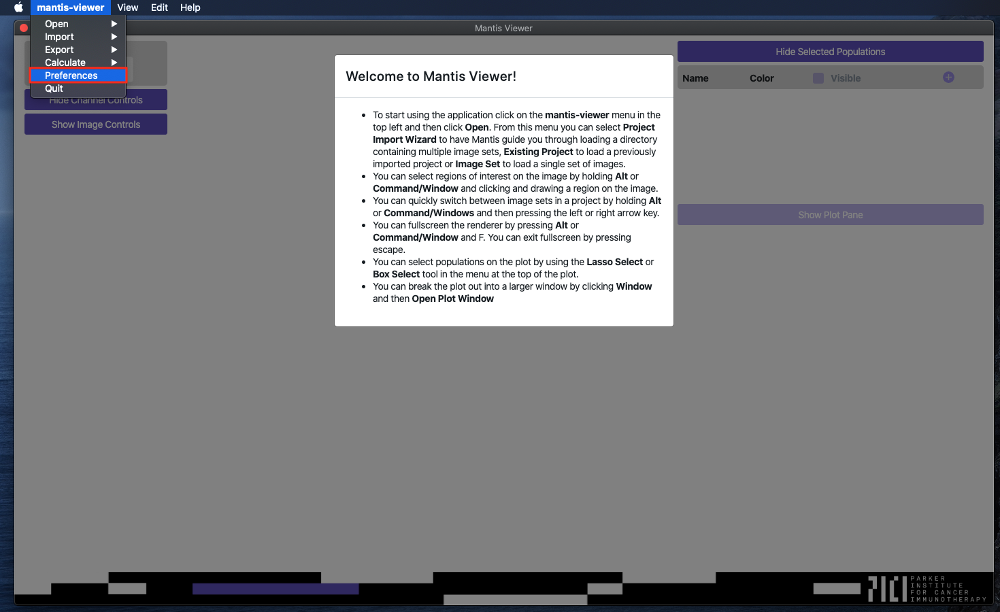

## Overview

Mantis Viewer allows the user to configure some default behaviors to improve the user experience or performance of the application. You can access the Preferences window by selecting the `Preferences` entry in the main menu.

## Configurable Preferences

The preferences window allows you to configure the following behaviors:

* The maximum number of images stored in memory
* The default segmentation filename
* The default brightness settings for each channel
* The default marker names and their selection priority for each channel
* Whether or not any marker should be selected if a default marker is not present for each channel
* If Mantis should scale (or directly copy) channel brightness values when switching between images.
* Whether or not pixels are blurred/smoothed
* If Mantis should optimize segmentation files for quick reloading (this takes up extra disk space).
* Whether or not Mantis should reload when it encounters an error
* If Mantis should automatically calculate segment intensities when loading segmentation data (set on a per-project basis).

## Maximum Images Stored in Memory
When viewing a project, Mantis keeps the most recently viewed images in memory so you can quickly switch between them without having to wait for them to reload. If too many images are stored in memory then Mantis may become slow or unresponsive. However, if very few image sets are stored in memory then you will have to wait as they are reloaded. This setting allows you to tune Mantis to optimally perform on your machine.