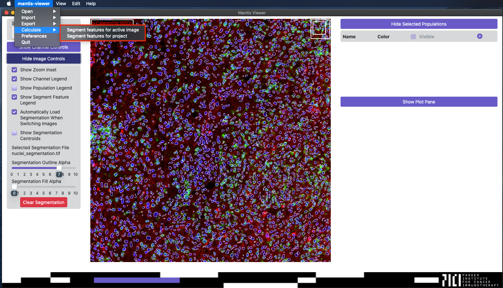

## Overview

In addition to segmentation data, many of the features in Mantis also rely on segment features. Segment features are numerical statistics that describe individual segments (e.g. cell size, or the mean or median pixel intensity for a marker or channel). Mantis is able to calculate mean and median segment intensities, and you can also [import custom segment features]({{ site.baseurl }}).

## Calculating Segment Features

Once segmentation data has been loaded, Mantis will ask you if you want it to calculate mean and median segment intensities. If you select yes, Mantis will calculate mean and median pixel intensities for every pixel and every marker or channel in the project. You can configure whether or not Mantis remembers your choice in [preferences]({{ site.baseurl }}). You can also force Mantis to calculate or recalculate the segment features for a single image set or the whole project using the `Calculate` entry in the main menu.

## Importing Custom Segment Features

You can import custom segment features from the main menu by selecting `Import` then `Segment Features` then `From active image set from CSV` or `For project from single CSV`. You can read about the CSV formats that Mantis accepts on the [importing segment features page]({{ site.baseurl }}).

