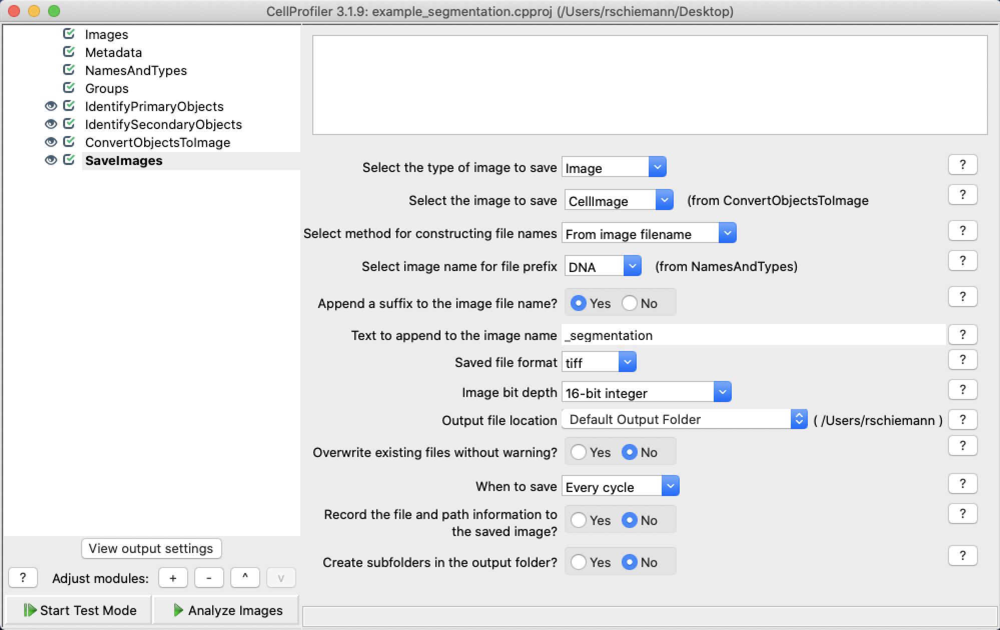

## Overview

Many of the features in Mantis rely on segmentation data. Segmentation is a process by which regions of an image are identified as cells. Mantis is not able to generate segmentation data, but there are many publicly available methods available to segment images.

## Segmentation Format

Mantis Viewer currently supports two different segmentation formats: a TIFF-based format and a TXT/CSV-based format. You can read about the formats on the [importing segmentation and region data page]({{ site.baseurl }}).

## Loading Segmentation Data

You can load segmentation data when loading a new project or by navigating to the opening main menu, selecting the `Import` menu entry, and then clicking on the `Segmentation` entry.

## Generating Segmentation Data

The Parker Institute for Cancer Immunotherapy does not currently provide any tools for generating segmentation data. We are currently working with our member labs to develop publicly available tools, and we will update this section when they are released. In the interim, you can use [CellProfiler](https://cellprofiler.org/) to generate segmentation data.

You can download our [example segmentation pipeline](../assets/files/example_segmentation.cpproj) if you've never used CellProfiler before and want an example to get you started. If you already have a segmentation pipleine built in CellProfiler you can make the following modifications to export the results in a format that Mantis accepts.

First, you will add a ConvertObjectsToImage module and select the output of your final segmentation module as the input and uint16 as the color format.

Finally, you will add a SaveImages module to save the image generated in the ConvertObjectsToImage module and to make sure that the image bit depth is set to 16-bit integer.

The output from the SaveImages module will be in the TIFF format described in the [Segmentation Format Section](#segmentation-format).

## Segmentation Display Controls

Once segmentation data has been loaded segment outlines will be overlaid on the image. You can access controls for displaying the segmentation data by clicking the button labeled `Show Image Controls`. Once the Image Controls have been expanded you can toggle whether or not centroids for segments are displayed, adjust the alpha of segment outlines, adjust the alpha of segment fills, and clear the segmentation data.

## Automatically Loading Segmentation Data

Mantis can be configured to automatically look for and load segmentation files when an image set or project is loaded. You can configure a default segmentation filename in [preferences]({{ site.baseurl }}).

Mantis can also automatically load segmentation files that do not match the default filename when switching between image sets in a project. To enable this behavior segmentation data files must be stored in their respective image set folders and all have the same name (e.g. ./project/imageSetOne/segmentation.tif, ./project/imageSetTwo/segmentation.tif, etc.).