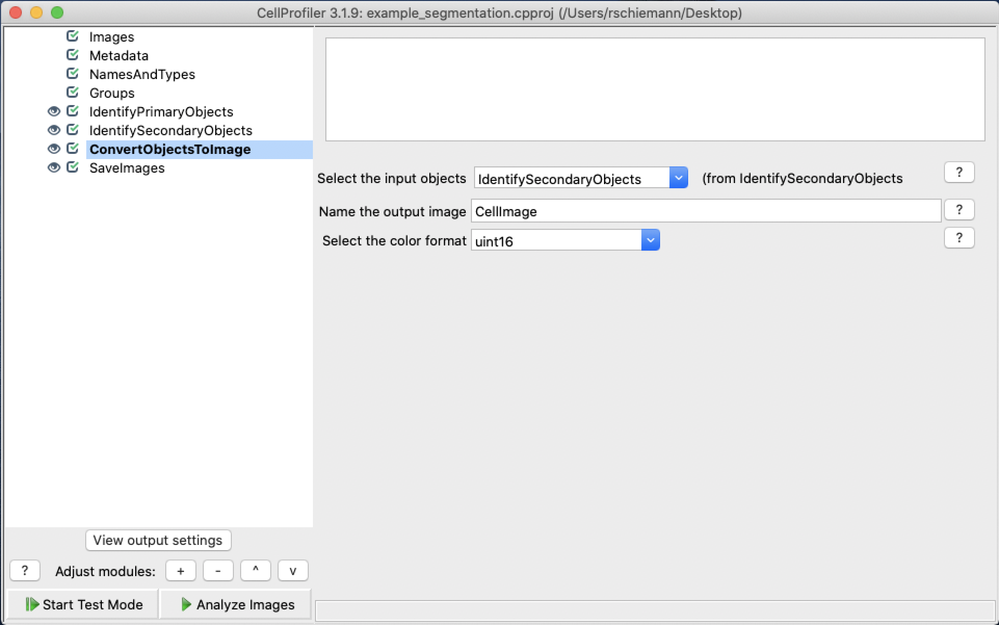
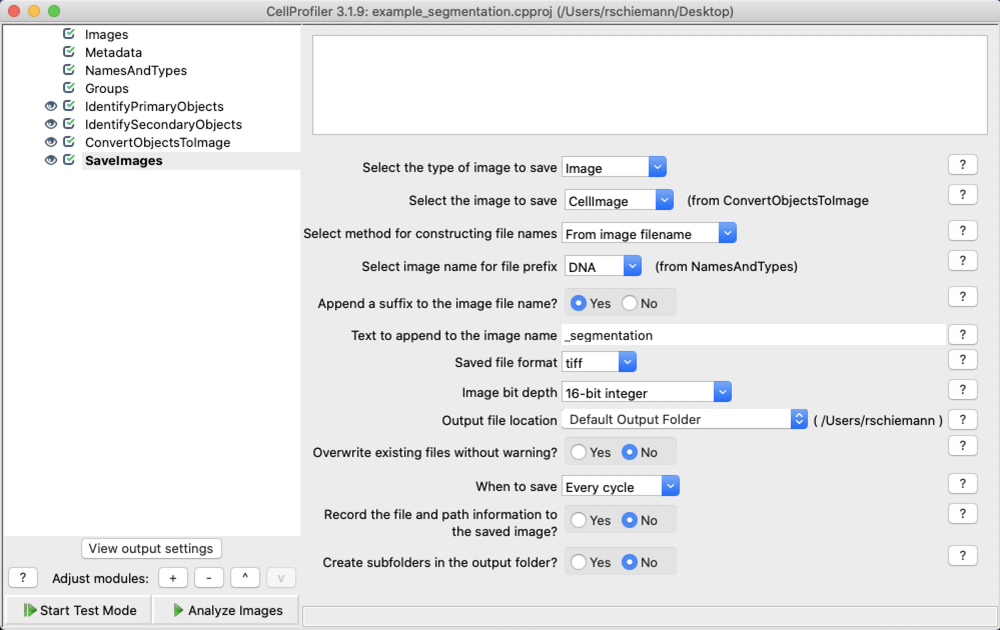

## Generating Segmentation Data

The Parker Institute for Cancer Immunotherapy does not currently provide any tools for generating segmentation data. We are currently working with our member labs to develop publicly available tools, and we will update this section when they are released. In the interim, you can use [CellProfiler](https://cellprofiler.org/) to generate segmentation data.

You can download our [example segmentation pipeline](../../assets/files/example_segmentation.cpproj) if you've never used CellProfiler before and want an example to get you started. If you already have a segmentation pipleine built in CellProfiler you can make the following modifications to export the results in a format that Mantis accepts.

First, you will add a ConvertObjectsToImage module and select the output of your final segmentation module as the input and uint16 as the color format.

Finally, you will add a SaveImages module to save the image generated in the ConvertObjectsToImage module and to make sure that the image bit depth is set to 16-bit integer.

The output from the SaveImages module will be in the TIFF format described in [importing segmentation and region data]({{ site.baseurl }}).