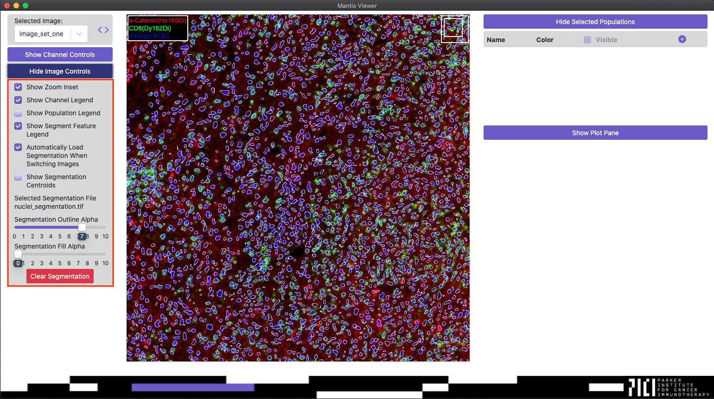

## Overview

Many of the features in Mantis rely on segmentation data. Segmentation is a process by which regions of an image are identified as cells.

Mantis is not able to generate segmentation data, but there are many publicly available methods available to segment images. If you have never generated segmentation data we recommend starting with [our tutorial for generating segmentation data with CellProfiler]({{ site.baseurl }}) as a starting point.

## Segmentation Format

Mantis Viewer currently supports two different segmentation formats: a TIFF-based format and a TXT/CSV-based format. You can read about the formats on the [importing segmentation and region data page]({{ site.baseurl }}).

## Loading Segmentation Data

You can load segmentation data when loading a new project or by navigating to the opening main menu, selecting the `Import` menu entry, and then clicking on the `Segmentation` entry.

## Segmentation Display Controls

Once segmentation data has been loaded segment outlines will be overlaid on the image. You can access controls for displaying the segmentation data by clicking the button labeled `Show Image Controls`. Once the Image Controls have been expanded you can toggle whether or not centroids for segments are displayed, adjust the alpha of segment outlines, adjust the alpha of segment fills, and clear the segmentation data.

## Automatically Loading Segmentation Data

Mantis can be configured to automatically look for and load segmentation files when an image or project is loaded. You can configure a default segmentation filename in [preferences]({{ site.baseurl }}).

Mantis can also automatically load segmentation files that do not match the default filename when switching between images in a project. To enable this behavior segmentation data files must be stored in their respective image folders and all have the same name (e.g. ./project/imageSetOne/segmentation.tif, ./project/imageSetTwo/segmentation.tif, etc.). You can enable or disable automatically loading segmentation data when switching images from the `Image Controls` pane.