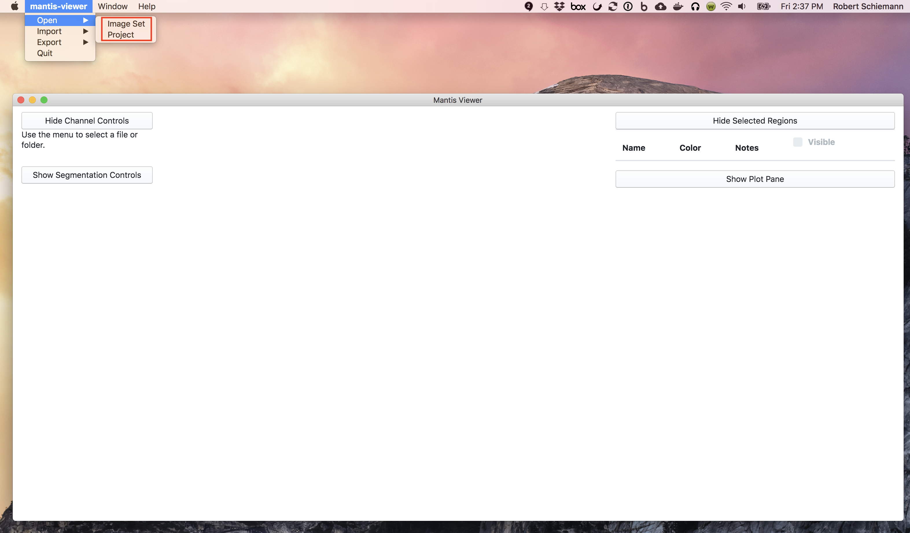
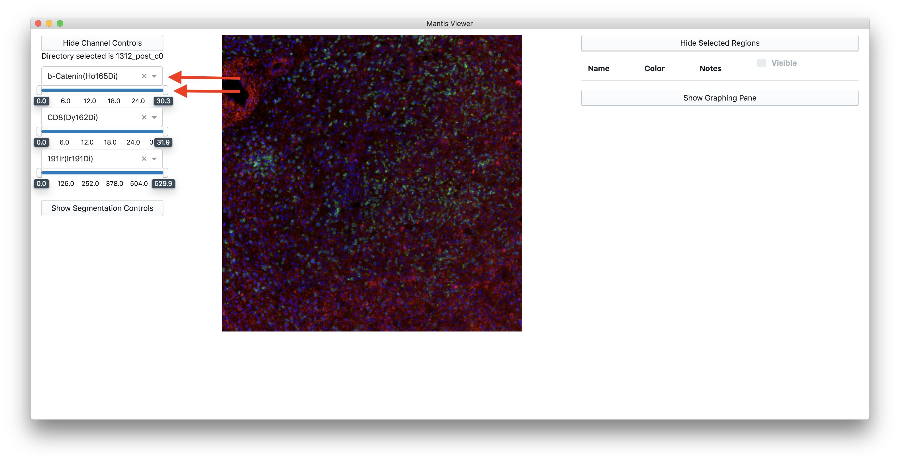
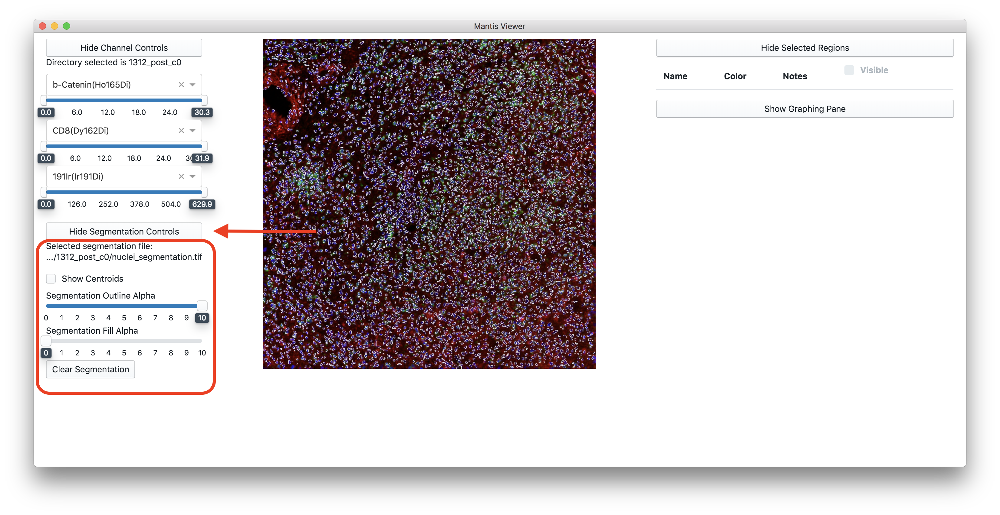
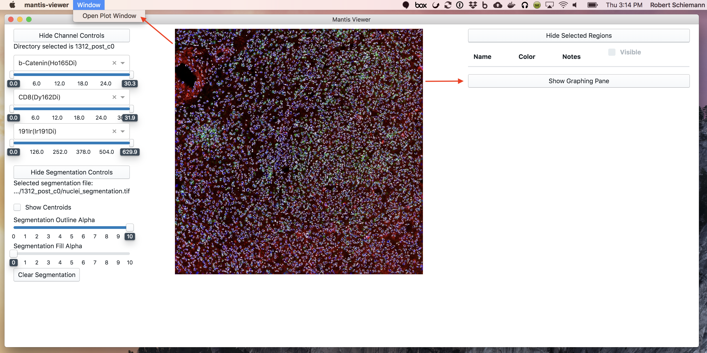
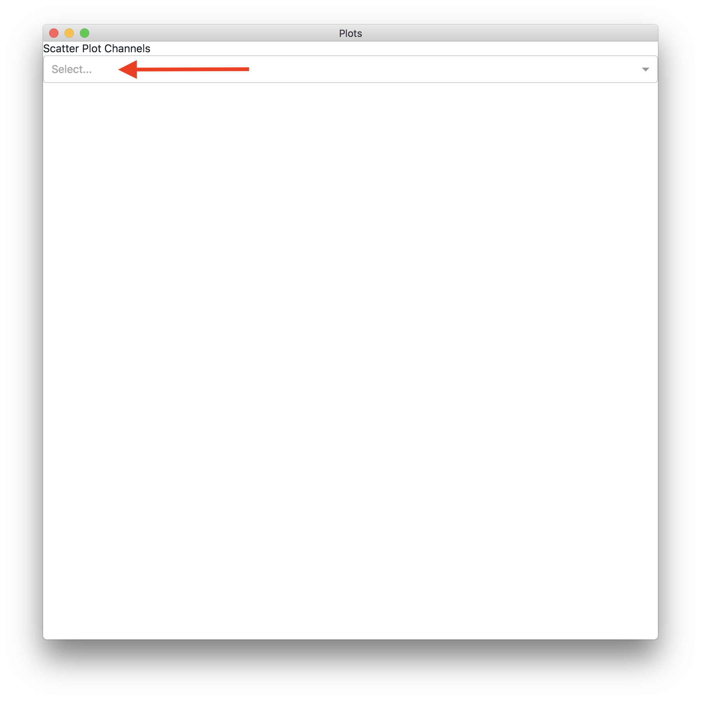
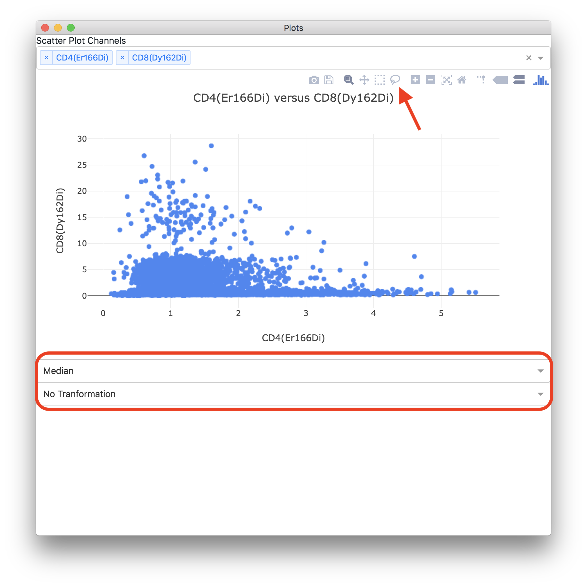
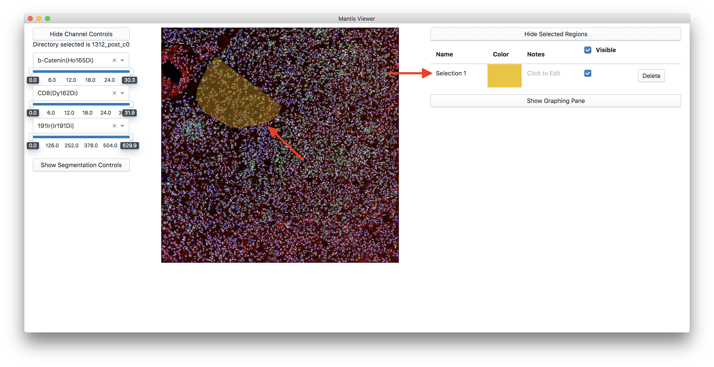
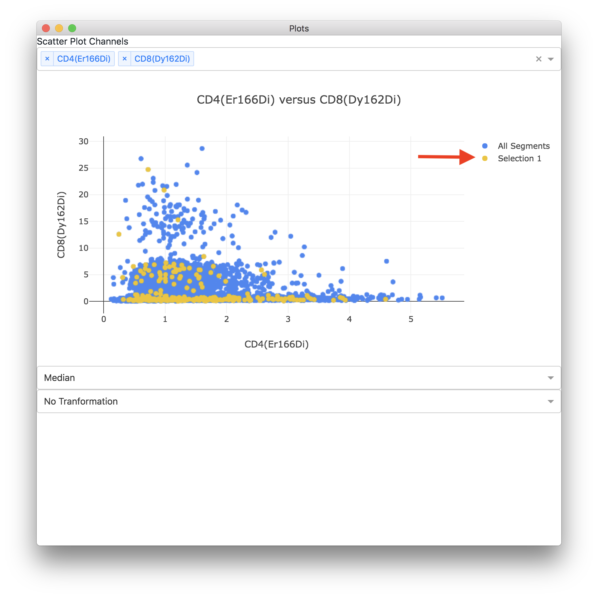

# Using Mantis Viewer #

## Getting started! ##

When you first load the application you should see a blank screen with a few unpopulated controls. Click the menu item named `mantis-viewer`, and then select `Open`.



In the `Open` submenu you should see option for `Image Set` and `Project`. For an `Image Set`, Mantis Viewer expects one folder with multiple images (one per channel) all stored as TIFFs. For a `Project` Mantis Viewer expects a folder containing multipe image sets.

## Switching Between Image Sets ##

If you have loaded a project you can switch between the image sets in the project by using the dropdown under the title `Selected Image Set`


If you want visualization settings (i.e. the selected channels, brightness levels, and segmentation appearance) copied as you switch between image sets then keep the box labeled `Copy Image Set Visualization Settings` checked.

## Color Controls ##

Once a folder has been selected, Mantis Viewer will select a random channel image for each color.



If you wish to change the channel selected for a color you can click on the dropdown and select a new channel. If you wish to clear a color you can click the `x` on the channel select dropdown.

You can adjust the brightness of a color by changing the min and max values on the slider below the color dropdown. The min and max values are set using the pixel intensities from the channel's TIFF. Brihtness adjustments are achieved by means of a linear transform.

## Segmentation Data ##

You can load segmentation data by hovering over `Import` and then `Segmentation` entries in the main menu. From here you can load segmentation data either `For active image set` or `For project`. If you select `For active image set` it will only load segmentation for the image set you are currently vewing. If you select `For project` it will attempt to find segmentation files with the same filename as the file you select in all of the open image sets.


 Mantis Viewer expects segmentation data to be loaded as a TIFF where pixels not belonging to a segment have a 0 value, and where pixels belonging to a segment have a numerical segment id as their value.

Once segmentation data has been loaded segment outlines will be overlayed on the image.



You can access controls for displaying the segmentation data by clicking the button labeled `Show Segmentation Controls`. Once segmentation controls have been expanded you can toggle whether or not centroids for segments are displayed, adjust the alpha of segment outlines, and adjust the alpha of segment fills. 

## Graphing ##

The graphing functions of Mantis Viewer allow you to view scatterplots of cell intensities per channel, as well as select and view populations of cells. If segmentation data is loaded you can access graphs of the data by clicking the `Show Graphing Pane` button or by selecting the `Open Plot Window` entry in the `Window` menu. Note: graph performance is usually better in the plot window, and the graphing pane will automatically close when the plot window is opened.
 


When you first load a graphing view you should see a blank view with a select form.



Click the form and start typing channel names. Once you've selected two different channels you should be shown a scatter plot comparing the intensities for each segment.



Once the scatter plot has loded you will be presented with a few more controls. Above the graph you will see a row of icons that can be used to manipulate the graph. Notable here is the camera, which can be used to export an image of the graph. Also notable is the lasso, which can be used to select a population of segments on the graph to be analyzed in a different scatter plot or viewed on the image. Below you'll find an example of selecting a population on the scatter plot.


## Selecting Regions or Populations ##

In addition to selecting populations on the scatter plot you can select regions or populations of interest on the image. You can accomplish this by holding down `Alt` or `Option` and clicking and drawing a region on the image.


Once you've selected a region or population on the image or in a scatter plot it will be shown in the list of selected regions to the right of the image. From the list of selected regions you can change the name, change the display color (by clicking on the colored square), take notes, toggle display on the image, or delete a selected region.



If segmentation data has been loaded selected regions will also be displayed on the scatter plot. You can toggle visibility of regions on the scatter plot by clicking on the colored dot next to the name in the legend.



## Adding Populations from CSV ##

Mantis Viewer allows you to import populations (i.e. from gating using other software). Using the main menu item `Import` then `Populations` then `For Active Image Set from CSV` you can add populations from a CSV file. Note that this menu item will be disabled unless segmentation data has been loaded for the currently active image set.

The CSV file selected should have no header, and each row should be of the format `segment_id, population_name`. For example, here are a few rows from a valid population CSV file:

```
220,CD4 High Cells
707,CD4 High Cells
220,CD8 High Cells
77,CD8 High Cells
140,CD8 High Cells
```

## Importing and Exporting Populations ##

You can save your selected regions and populations for use later by selecting the main menu item `Export` and then `Populations`. You can either export for the currently active image set by selecting `For active image set to JSON` or for all of the open image sets in a project by selecting `For project to JSON`. If you select `For project to JSON` it will ask you to save for the currently active image set, but it will also create and export to a file with the same name in the base directory of every image set with populations. Note that these menu options will only be enabled when you have selected populations for the currently active image set. 

You can reload exported populations at a later time by selecting the main menu item `Import` and then `Populations`. You can either import for the currently active image set by selecting `For active image set from JSON` or for all of the open image sets in a project by selecting `For project from JSON`. Importing for a project from JSON files works the same way as exporting: you select a JSON file for the currently active image set, and the application will look for JSON files with the same name in all of the base directories for every loaded image set.

## Exporting the Current Image with Layers ##

You can export the current image with layers from the main menu by selecting `Export` then `Image` then `Current Image and Layers`.
