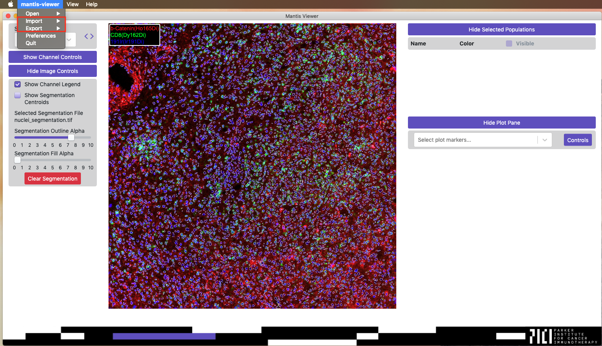

## Overview 

Mantis Viewer supports importing from and exporting to a variety of data formats. The import and export functionality of Mantis can be accessed from the main menu in the `Import` and `Export` submenus.



## Importing and Exporting Populations to JSON

You can save your selected regions and populations for subsequent use and analysis by selecting the main menu item `Export` then `Populations` and finally `For active image set to JSON`. The menu item will not be active until you have selected regions or populations on the image or from the plot.

You can reload exported populations at a later time by selecting the main menu item `Import` then `Populations` and finally `For active image set from JSON`.

Segmentation data can change between exporting and reimporting for populations selected on the image. Mantis will reselect the segments within the selected region when segmentation data changes. However, segmentation data cannot change between exporting and reimporting for populations selected on the plot. If your segmentation changes between exporting and reimporting then the selected segments will be incorrect.

## Importing and Exporting Populations to CSV

You can also allows you to import and export populations from CSVs (i.e. from or for use in other applications). Using the main menu item `Import` then `Populations` then `For Active Image Set from CSV` you can add populations from a CSV file. Note that this menu item will be disabled unless segmentation data has been loaded for the currently active image set.

When exporting to a CSV, the generated CSV will not contain any information about regions selected on the image. It will only contain information about segments selected either on the image or from the plot.

The CSV file selected should have no header, and each row should be of the format `segment_id, population_name`. For example, here are a few rows from a valid population CSV file:

```
220,CD4 High Cells
707,CD4 High Cells
220,CD8 High Cells
77,CD8 High Cells
140,CD8 High Cells
```

You must use the same segmentation data when exporting and importing populations from CSV. If your segmentation changes between exporting and reimporting then the selected segments will be incorrect.

## Exporting Segment Statistics to CSV

Statistics about segments can be exported to CSV by selecting the main menu item `Export` then `Segment Statistics to CSV` and then one of the options in that submenu. You can export either the mean or median segment intensities, and you can either export to one CSV for the active image set or to multiple CSVs for all open image sets. When exporting to CSV you will get the mean or median segment intensity, the X and Y coordinates of the segment centroid, and any populations the segment belongs to.

## Exporting Segment Statistics to FCS

Statistics about segments can also be exported to FCS by selecting the main menu item `Export` then `Segment Statistics to FCS` and then one of the options in that submenu. You can export either the mean or median segment intensities, and you can either export to one FCS for the active image set or to multiple FCS files for all open image sets. The FCS file format does not have the concept of populations or subpopulations, but Mantis supports exporting the selected populations to FCS files by exporting each population to its own FCS file.

## Exporting the Current Image with Layers

You can export the current image with layers from the main menu by selecting `Export` then `Image` then `Current Image and Layers`.
