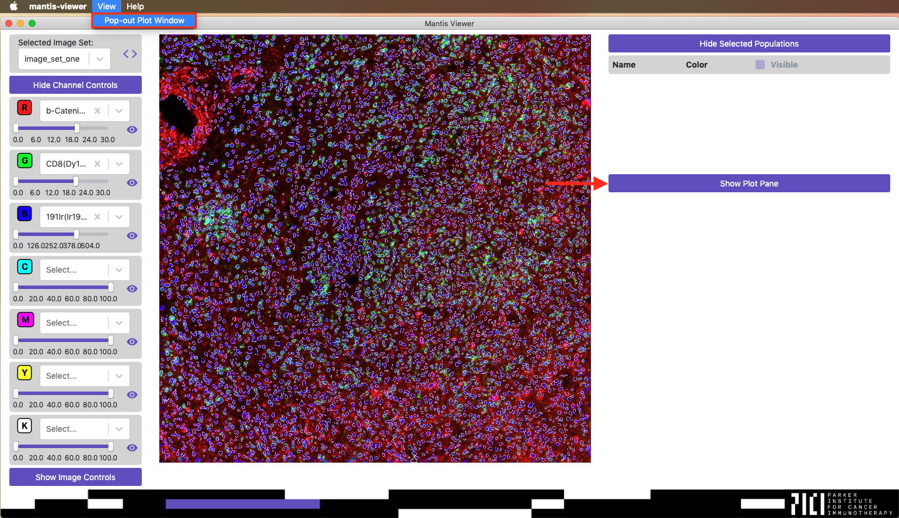

The graphing functions of Mantis Viewer supports visualizing cell intensities per markers, as well as select and view populations of cells. If segmentation data is loaded you can access graphs of the data by clicking the `Show Plot Pane` button or by selecting the `Pop-out Plot Window` entry in the `View` menu.

When you first load a graphing view you should see a blank view with a select form.

Click the field and start typing marker names. Once you've selected two different channels you should be shown a scatter plot comparing the intensities for each segment.

You can also click the `Controls` button to the right of the marker selection field to change the type of plot, the plot statistic used, how the data is normalized, or the size of dots on the plot

 
<video width="320" autoplay="autoplay" loop="loop">
  <source src="{{site.baseurl}}/videos/plot.mp4" type="video/mp4">
  <source src="{{site.baseurl}}/videos/plot.mp4" type="video/webm">
</video>
