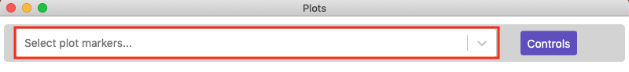

## Overview

Mantis Viewer can generate plots of segment (i.e. cell) intensity per marker. [Segmentation data]() must be loaded for Mantis to generate plots. The below animation gives a brief overview of generating and interacting with plots in Mantis.

<video width="320" autoplay="autoplay" loop="loop">
  <source src="{{site.baseurl}}/videos/plot.mp4" type="video/mp4">
  <source src="{{site.baseurl}}/videos/plot.mp4" type="video/webm">
</video>

## Basic Plotting in Mantis

 Once segmentation data has been loaded you can access plots of by clicking the `Show Plot Pane` button or by selecting the `Pop-out Plot Window` entry in the `View` menu.

When you first load the plot view you should see a blank view with a field that says `Select plot markers...`.

Click the field and start typing marker names. Once you've selected two different channels you should be shown a scatter plot comparing the intensities for each segment.

## Configuring  Plots

You can click the `Controls` button to the right of the marker selection field to change the type of plot, the plot statistic used, how the data is normalized, or the size of dots on the plot.

Mantis is able to generate scatter plots, contour plots, histograms, and heatmaps. For heatmaps, Mantis can normalize per marker or per population.

Mantis can use the mean or median intensity of pixels from a segment to generate plots. It is able to apply a Log or ArcSinh transformation with a user supplied coefficient to the data prior to plotting.

## Selecting Populations from the Plot

You can select populations in the plot to view on the image or in other plots by using the lasso select or the box select tools.

You can read more about populations on the [Populations page]()