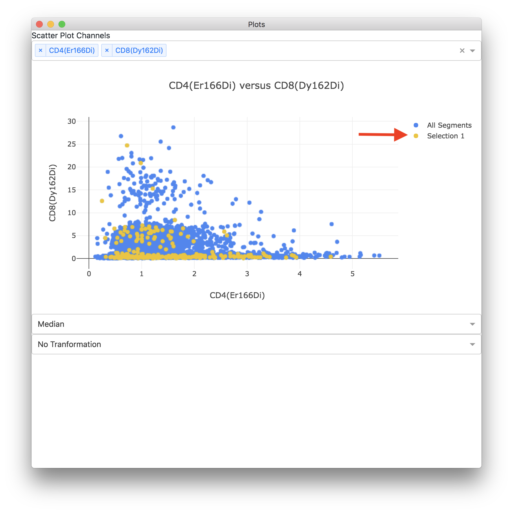

## Selecting Regions or Populations

In addition to selecting populations on the scatter plot you can select regions or populations of interest on the image. You can accomplish this by holding down `Alt` or `Option` and clicking and drawing a region on the image.

Once you've selected a region or population on the image or in a scatter plot it will be shown in the list of selected regions to the right of the image. From the list of selected regions you can change the name, change the display color (by clicking on the colored square), take notes, toggle display on the image, or delete a selected region.

If segmentation data has been loaded selected regions will also be displayed on the scatter plot. You can toggle visibility of regions on the scatter plot by clicking on the colored dot next to the name in the legend.

