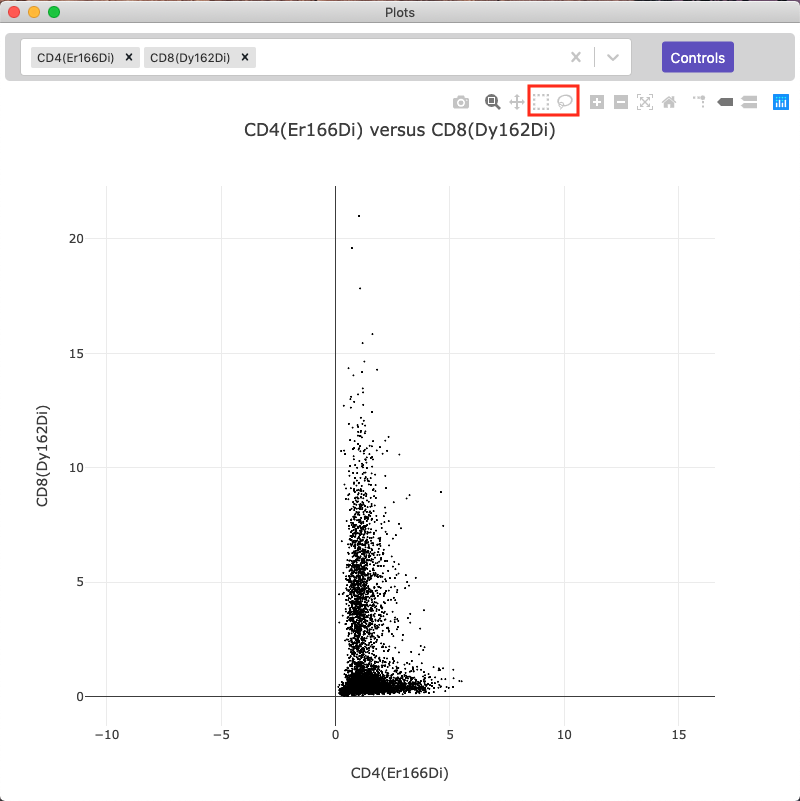
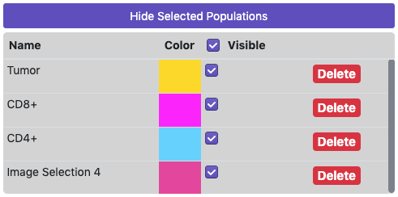
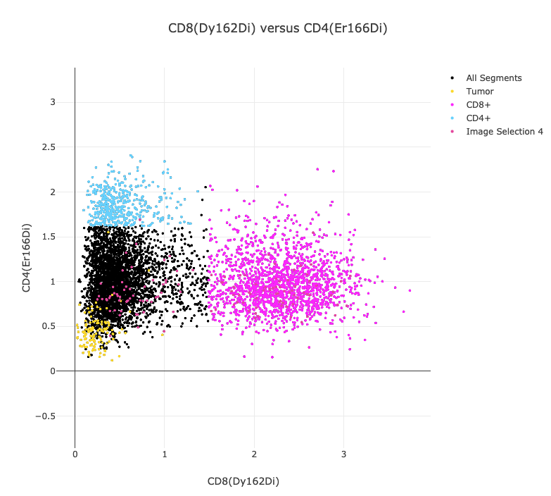

## Overview

Mantis Viewer allows users to select and store populations for further analysis. There are two ways to select populations in Mantis.

On the image:

<video autoplay="autoplay" loop="loop">
  <source src="{{site.baseurl}}/videos/population_on_image_640.mp4" type="video/mp4">
  <source src="{{site.baseurl}}/videos/population_on_image_640.mp4" type="video/webm">
</video>

Or from the graph:

<video autoplay="autoplay" loop="loop">
  <source src="{{site.baseurl}}/videos/population_on_graph_640.mp4" type="video/mp4">
  <source src="{{site.baseurl}}/videos/population_on_graph_640.mp4" type="video/webm">
</video>

## Selecting Regions or Populations

You can select population on the image by pressing Alt or Command/Windows and holding the left mouse button and outlining the region on the image. You can also select populations in the plot to view on the image or in other plots by using the lasso select or the box select tools.

Once you've selected a population on the image or in a plot it will be shown in the list of selected regions to the right of the image. From the list of selected regions you can change the name (by clicking on the name), change the display color (by clicking on the colored square), toggle display on the image, or delete a selected region.

If segmentation data has been loaded selected regions will also be displayed on the scatter plot. You can toggle visibility of regions on the scatter plot by clicking on the colored dot next to the name in the legend.

