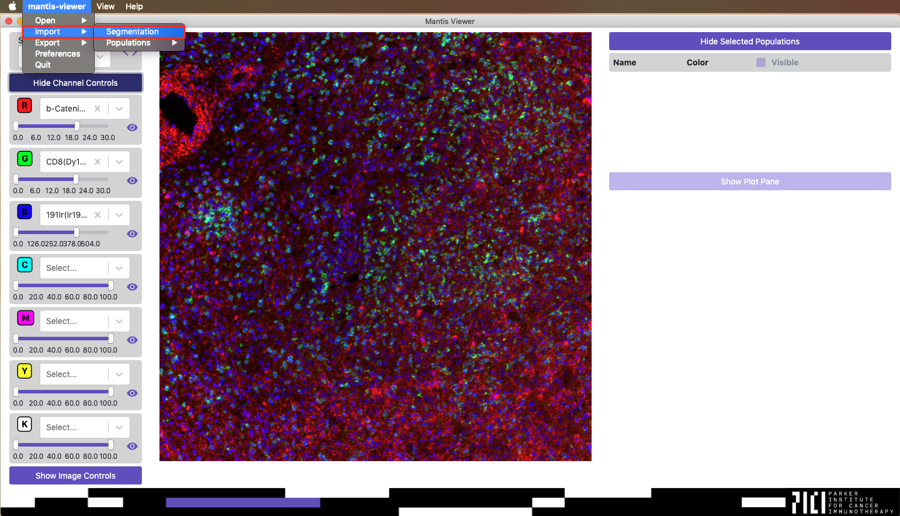
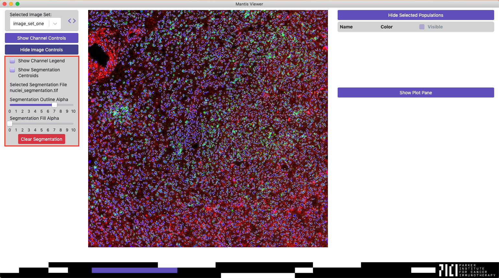

## Overview

Many of the features in Mantis rely on segmentation data. Segmentation is a process by which regions of an image are identified as cells. Mantis is not able to segment at this point in time, but there are many publicly available methods available to segment images.

## Segmentation Format

Mantis Viewer expects segmentation data to be stored as a TIFF where pixels belonging to a segment have a unique numerical segment id as their value (e.g. all of the pixels belonging to first segment have the value of 1, second segment has value of 2, etc.), and where pixels not belonging to a segment have a 0 value.

## Loading Segmentation Data

You can load segmentation data by clicking the menu item named `mantis-viewer`, opening the `Import` menu, and then clicking on the `Segmentation` entry.

## Segmentation Controls

Once segmentation data has been loaded segment outlines will be overlaid on the image. You can access controls for displaying the segmentation data by clicking the button labeled `Show Image Controls`. Once the Image Controls have been expanded you can toggle whether or not centroids for segments are displayed, adjust the alpha of segment outlines, adjust the alpha of segment fills, and clear the segmentation data.

## Automatically Loading Segmentation Data

Mantis can be configured to automatically look for and load segmentation files when an image set or project is loaded. You can configure a default segmentation filename in [preferences](). Mantis can also automatically load segmentation files that do not match the default filename when switching between image sets in a project. To enable this behavior segmentation data files must be stored in their respective image set folders and all have the same name (e.g. ./project/imageSetOne/segmentation.tif, ./project/imageSetTwo/segmentation.tif, etc.).
